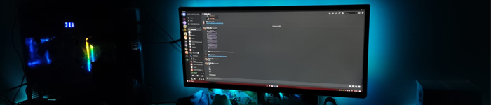
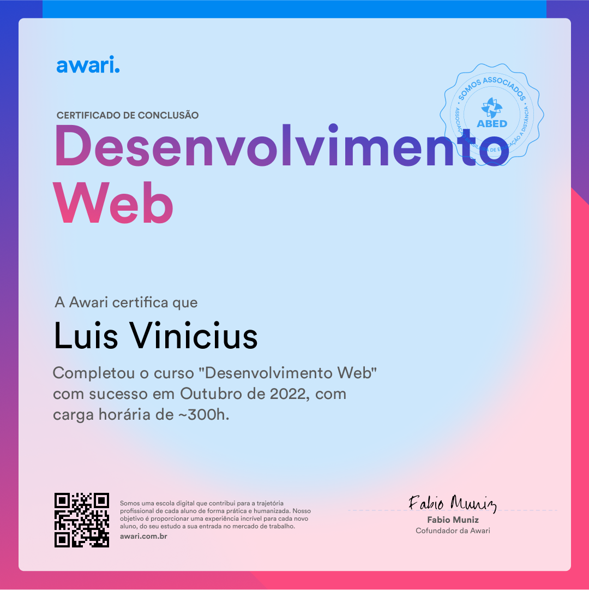

<h2 align="left">Sobre mim</h2>

###

Sou o Vini 🙂 - 🔭 Trabalho na Tudo em nuvem - 🃏 Aprendendo Docker/AWS - 💫 2004

 
###
<h2 align="center">Skills dominadas</h2>

###

 

  
  
  
  
  

###

  
  
  
  
  
  
  
  
  
  
  

###

<h2 align="center">Aprendendo / Quero aprender</h2>

###

  
  
  
  
  
  
  
  
  
  
  
  
  
  
  
  
  
  
  

###

<h2 align="left">Cursos</h2>

###

### [Awari](https://awari.com.br/)

- **Formação Desenvolvimento Web Full-Stack** - 300h
- **NodeJS e MongoDB** - 15h

 

### [Alura](https://www.alura.com.br/)
- **[Todos os cursos](https://cursos.alura.com.br/user/viinilv/fullCertificate/f17131528e29919dbe94b46312e40b8f)** - 100h+
