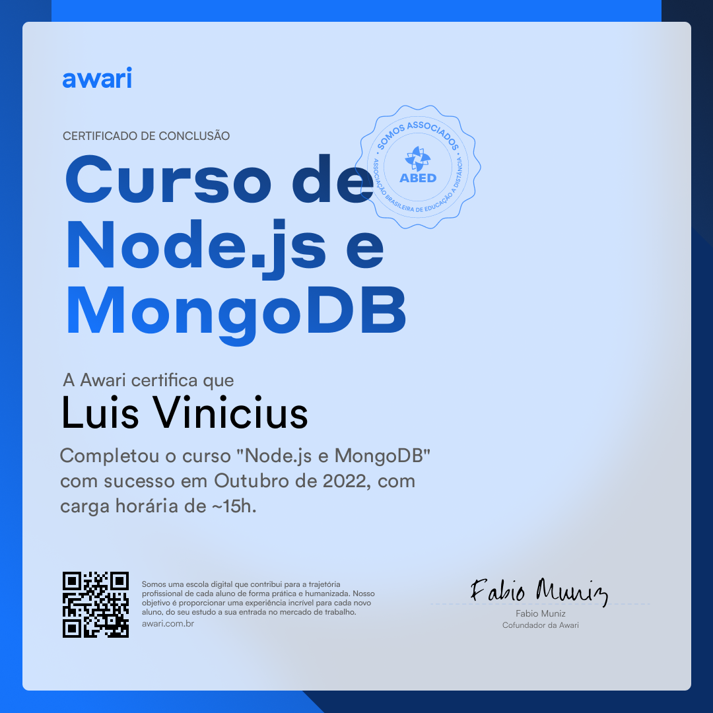

# Cursos e Certificados

### [Awari](https://awari.com.br/)

- **Formação Desenvolvimento Web Full-Stack** - 300h
- **NodeJS e MongoDB** - 15h

 

### [Alura](https://www.alura.com.br/)
- **[Todos os cursos](https://cursos.alura.com.br/user/viinilv/fullCertificate/f17131528e29919dbe94b46312e40b8f)** - 100h+

## 🛠️ Tecnologias 
- [TypeScript](https://www.typescriptlang.org/) | [Python](https://www.python.org/)
- [Express](https://expressjs.com/pt-br/) | [NestJS](https://nestjs.com/)
- [Mongoose](https://mongoosejs.com/)
